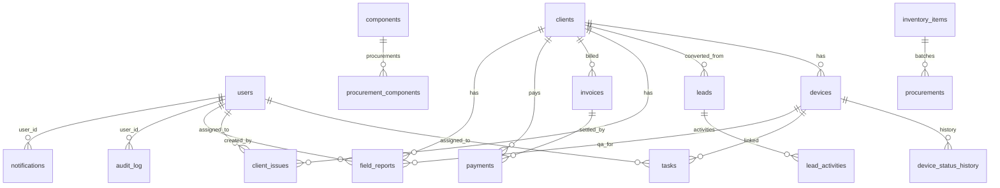

# Crop2X CRM — Entity Relationship Diagram

## Core Entities

## Tables Summary

| Table | Primary Purpose |
|-------|-----------------|
| `users` | Authentication & RBAC (7 roles) |
| `clients` | Active customer profiles, contracts, services |
| `leads` | Sales pipeline (7 stages) |
| `lead_activities` | Follow-ups, meetings, farm visits |
| `devices` | Hardware lifecycle (5 statuses) |
| `device_status_history` | Audit trail for device status changes |
| `tasks` | Internal work assignments |
| `client_issues` | Support tickets / cross-dept issues |
| `invoices` / `payments` | Billing & accounts |
| `components` / `procurement_components` | Raw hardware inventory |
| `inventory_items` / `procurements` | General inventory batches |
| `field_reports` | Agronomy field operations & QA |
| `audit_log` | System-wide activity logging |
| `notifications` | User alerts |
| `refresh_tokens` | JWT refresh token storage |

## Key Relationships

- **Client → Device**: Optional FK; required when device status is `INSTALLED`
- **Issue → Task**: Auto-created when issue assigned to Hardware/Agronomy
- **Lead → Client**: Linked via `client_id` after conversion (`POST /leads/{id}/convert`)
- **Invoice → Payment**: Payments reduce invoice balance; full payment sets status `PAID`
